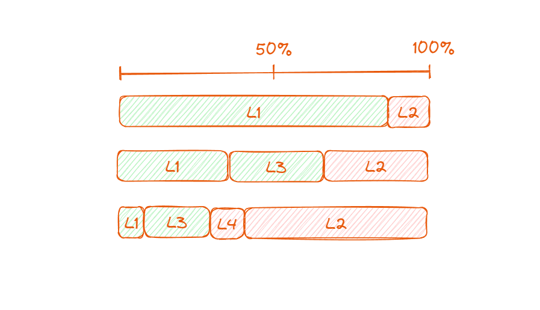

Mapping prepositions from the English language to ontological entities is a nuanced task, as prepositions often convey spatial, temporal, or logical relationships between different entities in a sentence. In ontology, these relationships are typically represented as relations or properties connecting classes or instances. Let's explore how some common prepositions map to ontological concepts:

## 1. "In" / "On" (Spatial Relations)

- Ontologically, these prepositions can be mapped to spatial relations. For instance, "the book is on the table" translates to a relation like `isOn(book, table)`. Such relations describe the physical positioning or containment of one entity in relation to another.

## 3. "Before" / "After" (Temporal Relations)

- These prepositions are indicative of temporal relations. In an ontology, they might correspond to relations like `precedes(event1, event2)` or `follows(event1, event2)`. They define the order of occurrence or sequence of events or actions.

## 5. "With" / "Without" (Association)

- These are often used to express association or disassociation. In ontological terms, they could be represented as associative relations, such as `associatedWith(entity1, entity2)` or `notAssociatedWith(entity1, entity2)`.

## 7. "By" (Agency or Method)

- When indicating agency, as in "the painting was done by the artist," it can map to a relation like `createdBy(painting, artist)`. If it indicates method, like in "travel by train," it could be represented as `methodOf(travel, train)`.

## 9. "Under" / "Over" (Hierarchical Relations)

- These prepositions often imply a hierarchy or an order. In ontological terms, they might be used to define hierarchical relations such as `isUnderneath(object1, object2)` or `isAbove(object1, object2)`.

## 11. "From" / "To" (Source and Destination)

- These prepositions can map to source-destination relations in ontology. For example, "He traveled from Paris to London" might be represented as `originatedFrom(travel, Paris)` and `destinedTo(travel, London)`.

## 13. "Of" / "For" (Possession or Purpose)

- "Of" often indicates possession or part-whole relationships, e.g., "the door of the car" could be represented as `partOf(door, car)`. "For" typically denotes purpose or intended use, e.g., "a key for the lock" could be `intendedFor(key, lock)`.

## 15. "Between" / "Among" (Inter-entity Relations)

- These prepositions are used to express relations among multiple entities. In ontology, "between" could be mapped to bilateral relations, while "among" to multilateral relations, like `locatedBetween(city, city1, city2)` or `partOfGroup(entity, group)`.

Understanding how prepositions map to ontological entities is crucial, especially in natural language processing (NLP) and semantic web technologies, where such mappings enable machines to comprehend and process the relational aspects of human language. These mappings provide a framework for interpreting the contextual relationships in data, enhancing machine understanding and interaction with human language.
